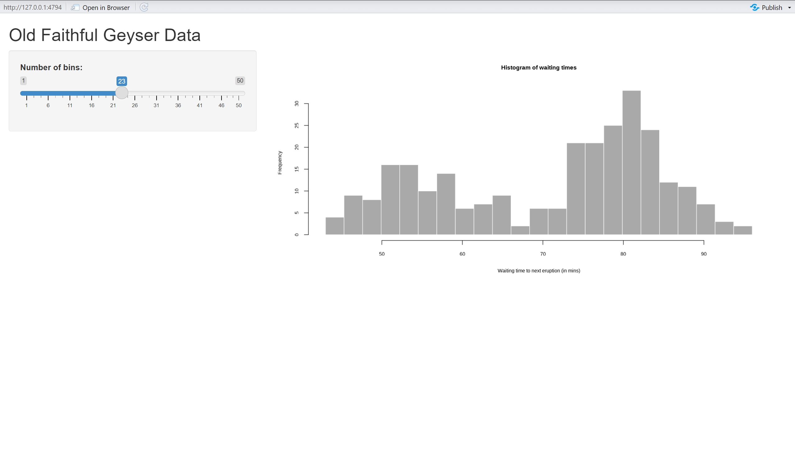

class: center, middle

# Get Started

---

## Hello World!

Install the **shiny** package from cran and library it.

```{r eval=FALSE, tidy=FALSE}
install.packages("shiny")
library(shiny)
```

--

You are recommended to use the [RStudio IDE](https://www.rstudio.com/products/rstudio/), but [Python](https://shiny.posit.co/py/) will also work well.

--

- Create a new R Shiny app document from the menu `File -> New Project -> New Directory -> Shiny Web Application -> Name your App -> Create Project`;         

--


              
---

## Run your App         

.left-column[
### click the `Run App` button
]

.right-column[

]


---

## First App

.left-column[
### adjustable histogram
]

.right-column[

]


---

# How to make it?      

To make a shiny app, You need to create two parts:

.pull-left[
```{r eval=FALSE}
# Define UI for application that draws a histogram
ui <- fluidPage(
  # Application title
  titlePanel("My First Shiny App"),
  
  # Sidebar with a slider input for number of bins
  sidebarLayout(
    sidebarPanel(
      sliderInput("bins",
                  "Number of bins:",
                  min = 1,
                  max = 50,
                  value = 30)
    ),
    
    # Show a plot of the generated distribution
    mainPanel(
      plotOutput("distPlot")
    )
  )
)
```

]

.pull-right[
```{r eval=FALSE}
# Define server logic required to draw a histogram
server <- function(input, output) {
  output$distPlot <- renderPlot({
    # generate bins based on input$bins from ui.R
    x <- faithful$waiting
    bins <- seq(min(x), max(x), length.out = input$bins + 1)
    # draw the histogram with the specified number of bins
    hist(x, breaks = bins, col = 'darkgray', border = 'white')
  })
}
```
]


---

# workflow     

```{r eval=FALSE}
library(shiny)

# See above for the definitions of ui and server
ui <- ...

server <- ...

shinyApp(ui = ui, server = server)
```


## Share your app online   
`sign up at https://www.shinyapps.io/ -> obtain your name, token, secret -> publish your app using rsconnect package`                                     

```{r eval=FALSE}
library(rsconnect)
rsconnect::setAccountInfo(name='qr5g6g-zhihu-xu',
                          token='',
                          secret='')
rsconnect::deployApp(appDir="C:/Users/zhihu/Desktop/LFS-AUmortality/website/LFSairShiny",
                     appName='LFSairShiny')
```


---
background-image: url(https://github.com/zhihu3456/funnypics/blob/main/draw_owl.png?raw=true)   
background-size: contain
class: center, top
      
# Thanks for your attention!


---

## useful resources      

1. [Shiny Gallery](https://shiny.rstudio.com/gallery)

2. [Shiny Layout](https://shiny.posit.co/r/layouts/)

3. [Shiny Examples](https://github.com/rstudio/shiny-examples)   

4. [Shiny Books](https://mastering-shiny.org/)    

5. [Shiny Cheatsheet](https://shiny.posit.co/r/articles/start/cheatsheet/)

6. [Share your App online](https://www.shinyapps.io/admin/#/dashboard)


---


## current app for my research         

1. [Heatwave and mortality in AUS](https://qr5g6g-zhihu-xu.shinyapps.io/hwshiny/)    
2. [LFS air pollution and mortlaity in AUS](https://qr5g6g-zhihu-xu.shinyapps.io/LFSairShiny/)        


